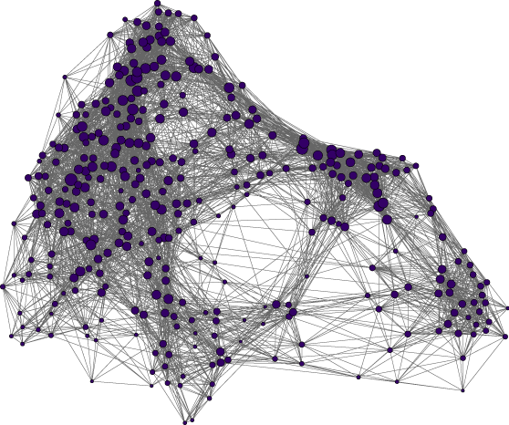
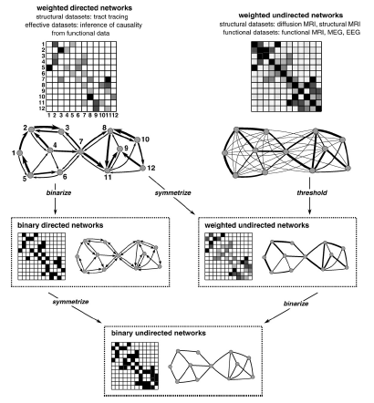
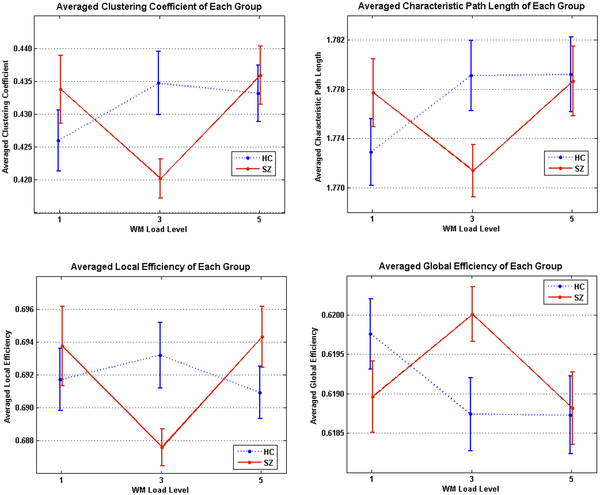

% Lecture #4: Comparing connectomes - graph theory, statistical learning, classifiers, and correcting for multiple comparisons
% R. Cameron Craddock, PhD
  Research Scientist VI, Nathan S. Kline Institute for Psychiatric Research, New York, NY
  Director of Imaging, Child Mind Institute, New York, NY
% July 31, 2014

---

#Comparing connectomes

- Once we have a connectome graphs for a set of individuals, the next challenge is comparing them
    - Indentify connections withen the graph, or subgraphs, that vary with disease state or other phenotype

    

---

# What is a graph?

- Mathmatical description of the relationship between ``things''
- Consists of nodes and edges
- Nodes correspond to brain areas
- Edges correspond to connections between brain areas
    - structural connections from dMRI
    - functional interactions from fMRI
- Graphs derived from fMRI and dMRI data can be treated similarly, except for a few exceptions    
    
---

# Weighted and binarized

- Edges in a weighted graph are annotated with a weight that corresponds to the edge strength
- No such weighting is used with binarized graphs

<figure><figcaption><small>Rubinov and Sporns, *NeuroImage*, 2010.</small></figcaption></figure>

---

# A note about Thresholding

- Although, every node *could* be connected to every other node, this is not likely the case
- Use thresholding to remove unlikely connections due to poor strength or likelihood of error
- Thresholding is also necessary for binarizing connections
- **Sparsity threshold**: keep only a fraction of the strongest connections
- **Significance threshold**: remove edges that may have arisen by chance
- Although negative correlations can and do arise in functional connectivity, they are hard to interpret in a graph sense and are often removed
     

---

# Bag of edges

- The most obvious is to perform a *univariate* test on each connectome of the graph
    - Allows commonly employed statistical tests such as t-tests and general linear models to be employed 
- The result is a very large number of connections $\frac{N_{vox}*(N_{vox}-1)}{2}$ 
    - 19 900 connections when $N_{vox}=200$
- As a consequence, their will be a large number of *false positives* unless a control for multiple comparisons in employed
    - Bonferroni Correction, False Discovery Rate (FDR), Groupwise FDR, Network Based Statistic

---

# Prediction Modeling

- Another option for *bag of edges* style analyses take into account interactions between features
- Also, estimate the significance of an identified pattern differences based on $p(\text{disease state}|\text{pattern})$ rather than $p(\text{pattern}|\text{NULL})$

---

# Classification

- Given a training set of observations and corresponding (categorical) labels, the objective is to find a linear hyperplane that is capable of seperating observations from different categories
- For linearly seperable data there are an infinite number of hyperplanes that meet this requirement
- **Support Vector Classification** finds the unique hyperplance that maximizes the perpendicular distance from the hyperplace to the nearest observations of a class (**margin**)

---

# Train vs. Test

- Training is the process of solving a mathmatical algorithm to learn a classifier
    - Requires: Data + Labels
    - Results: Model
- Testing involves applying the classifier to a never-before-seen dataset to estimate *prediction accuracy* (or *generalization error*)
- Test and training datasets should be independent to avoid biased estimates of prediction accuracy

---

# Bag of Edges Predictive Modeling

<figure><figcaption>Craddock et al. *Magnetic Resonance in Medicine* 2009. </figcaption></figure>

---

# Feature Selection

- Filter methods: Perform a univariate test at each edge and only include those that pass a liberal threshold (univariate criterion that is not sensitive to multivariate relationships)
- Reliability Filter: Estimate bootstrap confidence intervals and exclude features whose 95% CI include zero 

<figure><figcaption>Craddock et al. *Magnetic Resonance in Medicine* 2009. </figcaption></figure>

---

# Connectome Wide Association Studies

<figure><figcaption><small>Shehzad et al. *NeuroImage*, 2014.</small></figcaption></figure>

---

# Graph Invariants

- As an alternative, we can reduce the number of tests to one per node or one per graph using **graph invariants** (complex network measures)
- Graph invariants: a property of a graph that does not depend on the graphs represtation or orientation
- The same graph can be represented in many different ways

<figure><figcaption><small>The same graph arranged in two different ways. Created with Gephi.</small></figcaption></figure>

--- 

# Node Centrality (Hubbiness)

- The relative importance of a node in a network, determined by its connections
- **Degree**: Number of links connected to a node
- **Closeness Centrality**: the average of the inverse distance from the node to all other nodes
- **Betweenness Centralty**: the average length of all shortest paths that pass through a node
- **Eignevector**: average of the centrality measures for the nodes that a target node is connected to 
- **Pagerank Centrality**: derives a score based on the number and centrality of the nodes a target node is connected to (Google's algorithm)

---

# Efficiency

- Efficiency is a measure of how quickly information can travel between any two nodes in a network
- **Global efficiency**: The average inverse shortest distance between every two points in a network
- **Local efficiency**: the inverse of the average shortest path connecting all neighbors of a vertex.

---

# Small Worldness

- Small world graphs, are graphs in which nodes can be quickly reached from every other node by a small number of hops, although the number of edges between nodes is minimized
- **Clustering Coefficient (C)**: the number links that exist between a node and its neighbors, divided by all possible links to neighboring nodes
- **Characteristic Path Length (L)**: The average of all shortest paths in the network
- **Small worldness** of a network is $S=\frac{\frac{C}{C_{rand}}}{\frac{L}{L_{rand}}}, where $C_{rand}$ and $L_{rand}$ are the clustering coefficient and characteristic path lengths that would have been obtained from randomly generated graphs with the same number of nodes and edges.
- if *S>1.0* the graph is said to be ``small world'' which means that 
    - its clustering coefficient is higher then expected from a random graph (resilient to point attacks) 
    - its average path length is shorter than expected from a random graph (efficient)
    
---

# Functional vs. Structural

- Since functional interactions do not imply a route or wire between connected regions, path measures don't make since for these graphs
    - i.e. the fact that A is connected to B and B is connected to C does not imply that information can travel from A to C, if A and C were where functionally connected, their activity would be correlated
- This is not the case for structural graphs

--- 

# Example: Small Worldness in Schizophrenia

<figure><figcaption><small>Small world properties of funcitonal connectivity networks differ between healthy controls and schizophrenics. He et al. *PLoS One* 2012. </small></figcaption></figure>

